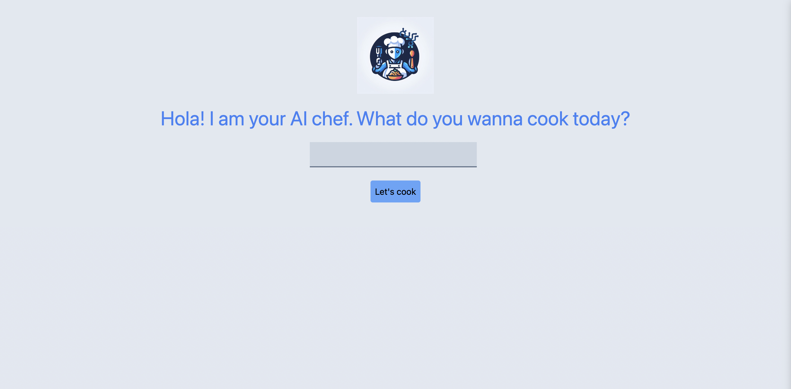
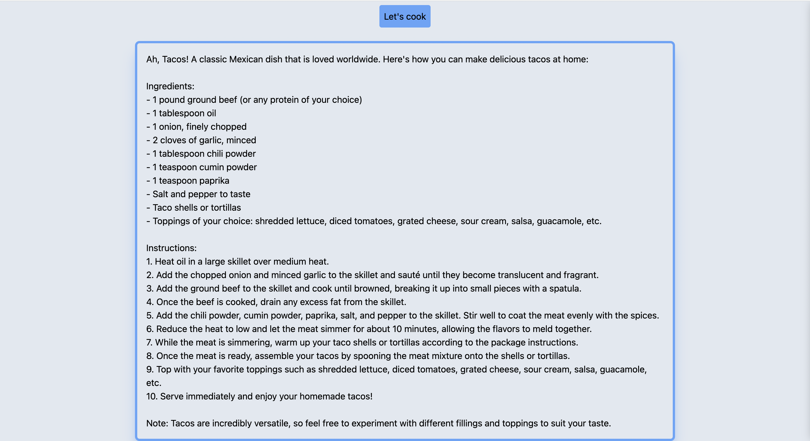

# Cooking with AI 🍳🤖

Welcome to Cook with AI, an AI-powered assistant that helps you cook a dish of any cuisine from the world! This project utilizes Next.js, TailwindCSS and leverages OpenAI's GPT-3.5 Turbo API to provide detailed cooking instructions and ingredients for various recipes.

## Table of Contents

- [Introduction](#introduction)
- [Features](#features)
- [Setup](#setup)
- [Usage](#usage)
- [Contributing](#contributing)
- [License](#license)

## Introduction

Cookwith AI is a web application that allows users to enter the name of a dish of any cuisine they want to cook and receive step-by-step instructions along with a list of ingredients needed. This project harnesses the power of OpenAI's GPT-3.5 Turbo API to generate comprehensive cooking instructions based on user queries.

## Features

- **AI-Powered Assistance:** Utilizes OpenAI's GPT-3.5 Turbo API for generating recipes and cooking instructions.
- **Recipe Search:** Users can input the name of a dish and receive detailed instructions on how to prepare it.
- **Ingredient Listing:** Provides a list of ingredients required for the specified dish.
- **Step-by-Step Guide:** Offers a step-by-step guide to assist users throughout the cooking process.

## Setup

To run this project locally, follow these steps:

1. Clone this repository: `git clone https://github.com/your-username/cooking-with-ai.git`
2. Navigate to the project directory: `cd cooking-with-ai`
3. Install dependencies: `npm install`
4. Set up environment variables for OpenAI's GPT-3 API access.

## Usage

1. Start the development server: `npm run dev`
2. Access the application via your web browser at `http://localhost:3000`.
3. Enter the name of the dish you want to cook in the provided input field.
4. Get detailed cooking instructions and ingredient list generated by the AI assistant.

## Contributing

Contributions are welcome! If you'd like to contribute to this project, feel free to fork the repository and submit a pull request with your changes.
